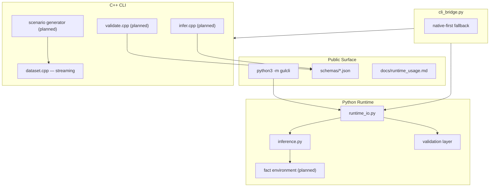

# GUL CLI v2.2.0+ Roadmap Design

Status: Approved direction (2026-07-01)  
Repository: `torakagemusha-sudo/gulcli`  
Scope: Documentation consolidation, public surface cleanup, and phased feature delivery

---

## 1. Context

### Current state (post-consolidation baseline)

| Area | Status |
|------|--------|
| Python `validate` / `infer` | Real, file-backed, schema-valid outputs |
| C++ `validate` / `infer` | Placeholders only (`cpp/src/cli.cpp`) |
| JSON schema registry | Complete under `schemas/` |
| Dataset generation | Built-in toy pools; not spec-driven |
| Python unit tests | 5 tests in `tests/test_runtime_io.py` |
| CI | Python 3.10–3.13 on Linux (`.github/workflows/runtime-ci.yml`) |
| Documentation | Consolidated; capability matrix in `docs/runtime_usage.md` |

### Open PR consolidation (resolved)

Three overlapping documentation PRs (#6, #7, #9) were superseded by a single consolidation branch:

| Source PR | Disposition | Rationale |
|-----------|-------------|-----------|
| #6 `technical-documentation-automation-51a6` | **Closed** | Conflicted with merged PR #8; content absorbed |
| #7 `codebase-documentation-alignment-01eb` | **Closed** | AGENTS.md C++ build guidance merged |
| #9 `engineering-documentation-updates-4446` | **Closed** | Capability matrix, bounded streaming, placeholder caveats merged |

### Public surface policy

All public documentation (`README.md`, `docs/`, `AGENTS.md`, `pyproject.toml`, package docstring) must **not** reference external integration frameworks. Internal modules (`compiler.py`, `integration.py`) remain in the codebase for backward compatibility but are not part of the public API surface documented for end users.

---

## 2. Strategic goals (A + B + C)

The next development phases pursue three parallel tracks:

| Track | Goal | Release spec mapping |
|-------|------|---------------------|
| **A — v2.2.0 closure** | Make native CLI and generation truthful | WP-01, WP-02, WP-04, WP-06 |
| **B — Python runtime depth** | Executable atoms, richer temporal semantics | Extends WP-02 beyond minimum |
| **C — Production hardening** | Golden tests, packaging, multi-platform CI | WP-05, release cut criteria |

---

## 3. Architecture overview



---

## 4. Phase plan

### Phase 0 — Documentation closure (complete)

**Deliverables:**
- Consolidated `docs/runtime_usage.md` with capability matrix
- Updated `AGENTS.md` (Python + C++ build + Wine paths)
- Updated `README.md` and `cpp/README.md` with truthful capability boundaries
- Removed external framework references from public docs

**Acceptance:** Every documented smoke command runs as written on Linux with `python3`.

---

### Phase 1 — Production hardening (Track C)

**Goal:** Make the Python runtime release-gate worthy before expanding scope.

| Task | Component | Acceptance criteria |
|------|-----------|---------------------|
| 1.1 Golden output tests | `tests/golden/` | Byte-stable JSON for validate/infer on fixture specs |
| 1.2 Schema validation tests | `tests/test_schemas.py` | All CLI JSON outputs validate against `schemas/` |
| 1.3 README command smoke CI | `.github/workflows/runtime-ci.yml` | CI runs every documented `python3 -m gulcli` example |
| 1.4 Packaging workflow | `.github/workflows/` | `pip install` from sdist/wheel succeeds; version aligned |
| 1.5 Windows C++ sanity job | CI matrix | `gul.exe` or built binary smoke test on Windows runner |

**Exit criteria:** All Phase 1 tests green; no undocumented behavior in public JSON envelopes.

---

### Phase 2 — v2.2.0 native closure (Track A)

**Goal:** C++ CLI performs real file-backed work; dataset generation becomes spec-driven.

#### 2A — Native validate/infer

| Task | Files | Behavior |
|------|-------|----------|
| 2A.1 File loader | `cpp/src/schema_io.cpp` | Load `*.gul.json`, normalize IR |
| 2A.2 Native validate | `cpp/src/validate.cpp` | Emit `gul.validation.result/1`; nonzero exit on errors |
| 2A.3 Native infer | `cpp/src/infer.cpp` | Emit `gul.inference.result/1`; `--trace` support |
| 2A.4 CLI wiring | `cpp/src/cli.cpp` | Replace placeholders; share semantics with Python |
| 2A.5 Cross-runtime parity tests | `tests/` | Python and C++ produce equivalent results on golden fixtures |

**Design rule:** Python remains the reference implementation until parity tests pass; C++ must not diverge on combiner semantics.

#### 2B — Spec-driven corpus generation

| Task | Files | Behavior |
|------|-------|----------|
| 2B.1 Scenario registry | `cpp/src/scenarios/` | permit, deny, defer, abstain, conflict, threshold-fail families |
| 2B.2 Spec linkage | `cpp/src/dataset.cpp` | Samples carry `source_spec_id`, `scenario`, `seed`, `generator_version` |
| 2B.3 CLI flags | `cpp/src/cli.cpp` | `--scenario balanced|adversarial`, `--stats` |
| 2B.4 Remove toy pool | `cpp/src/dataset.cpp` | Generation derives from declared scenario templates |

**Exit criteria:** Release cut checklist items for validate, infer, and spec-driven generation are satisfied (`RELEASE_SPEC_v2_2_0.md` §8).

---

### Phase 3 — Python runtime depth (Track B)

**Goal:** Close the largest functional gap in the Python path — `atom` execution and temporal fidelity.

#### 3A — Fact environment for atoms

| Task | Component | Behavior |
|------|-----------|----------|
| 3A.1 Fact store API | `runtime_io.py` or new `facts.py` | Named entity/predicate bindings for evaluation |
| 3A.2 Atom evaluator | `runtime_io.py` | `belongs_to`, `has_role`, `has_attribute`, `in_context`, time predicates |
| 3A.3 CLI fact injection | `runtime_io.py` | `--facts facts.json` optional input |
| 3A.4 Validation extension | schemas | Document fact-environment requirements in validation errors |

#### 3B — Temporal semantics upgrade

| Task | Component | Behavior |
|------|-----------|----------|
| 3B.1 Trace enrichment | `inference.py` | Temporal steps visible in `--trace` output |
| 3B.2 `until` composition | `inference.py` | Documented approximation vs target semantics |
| 3B.3 Model-checking boundary | docs | Explicit "structural approximation" vs "full LTL" in limitations |

**Exit criteria:** `examples/specs/` includes atom-backed specs that execute end-to-end; trace shows predicate resolution.

---

### Phase 4 — Release cut (Tracks A + B + C converge)

| Milestone | Version | Condition |
|-----------|---------|-----------|
| Doc-only patch | `2.1.1` | If only documentation lands before native closure |
| Full closure | `2.2.0` | All §8 release cut criteria in `RELEASE_SPEC_v2_2_0.md` |

**Release gate checklist:**
- [ ] Native `validate` and `infer` are real
- [ ] Dataset generation is spec-driven with provenance
- [ ] Golden tests pass on Python 3.10–3.13
- [ ] Schema validation tests pass for all public JSON artifacts
- [ ] README and `docs/runtime_usage.md` match implementation
- [ ] Wheel/sdist install verified in CI

---

## 5. Component boundaries

| Unit | Responsibility | Depends on |
|------|----------------|------------|
| `runtime_io.py` | File-backed validate/infer CLI and helpers | `inference.py`, schemas |
| `inference.py` | GUL combiner semantics and trace | `decision.py`, `confidence.py` |
| `cli_bridge.py` | Native subprocess orchestration | `runtime_io.py`, native binary |
| `cpp/src/validate.cpp` | Native validation (planned) | schema IO, C++ inference types |
| `cpp/src/infer.cpp` | Native inference (planned) | C++ inference engine |
| `cpp/src/dataset.cpp` | Scenario-driven streaming (planned) | scenario registry |

Each unit must be testable independently with golden fixtures before integration.

---

## 6. Error handling

| Failure | Surface | Behavior |
|---------|---------|----------|
| Invalid JSON input | validate | `ok=false`, exit 1, schema-valid error envelope |
| Unknown tag | validate | Error code with JSON path |
| Missing fact for atom | infer | Actionable error naming required fact keys |
| Native binary missing | cli_bridge | Silent fallback to Python for validate/infer |
| Native placeholder invoked | cli_bridge | Return success (current); fixed when Phase 2 ships |
| Unbounded streaming | native CLI | Documented; bounded by `-n` or `max_samples` |

---

## 7. Testing strategy

| Layer | Tests | Gate |
|-------|-------|------|
| Unit | Combiner semantics, confidence bounds, jurisdiction | Always |
| Golden | Fixed spec → fixed JSON output | Phase 1 |
| Schema | Output validates against `schemas/` | Phase 1 |
| Parity | Python vs C++ on same fixtures | Phase 2 |
| Smoke | README commands in CI | Phase 1 |
| Packaging | sdist/wheel install | Phase 1 |

---

## 8. Out of scope

- Full Lean artifact execution chain
- Theorem proving pipeline
- Distributed governance runtime
- Rich standalone language frontend beyond JSON IR
- UI / web console
- Public documentation of legacy integration adapters

---

## 9. Recommended execution order

```
Phase 0 (docs) → Phase 1 (hardening) → Phase 3A (atoms) ∥ Phase 2A (native validate/infer)
                                         → Phase 2B (spec-driven generation)
                                         → Phase 3B (temporal depth)
                                         → Phase 4 (2.2.0 tag)
```

Phase 1 and Phase 3A can start immediately in parallel — hardening does not block atom work, and atom work does not require native C++ changes.

---

## 10. Success metrics

| Metric | Target |
|--------|--------|
| Documented commands that run as written | 100% |
| Public JSON artifacts schema-valid | 100% |
| Golden fixtures with byte-stable output | ≥10 specs |
| Native/Python parity on golden set | 100% before 2.2.0 |
| Open documentation PRs | 0 (consolidated) |
